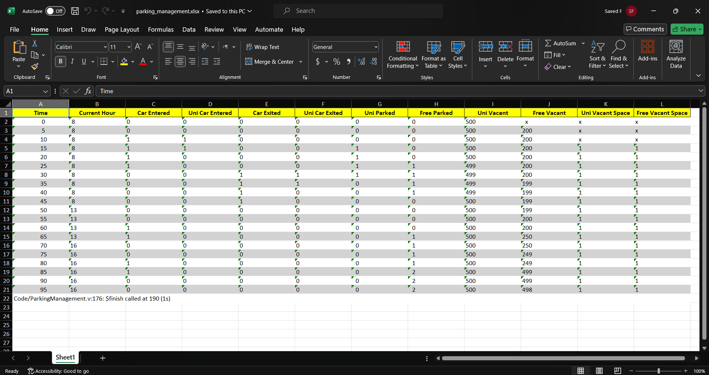

# Parking-Management
<p align="center">  
    
</p> 
This project is a Parking-Management simulator by verilog. it has additional options for university such as the priority of the parking space that is for university professors and employees. After office hours, the parking capacity for ordinary people increases.

## Installation

1. Clone the repository:
```
git clone https://github.com/foratik/Parking-Management.git
```
2. Install dependencies:
```
pip install pandas openpyxl
```
3. Install iverilog:
   
    You can visit [here](https://iverilog.fandom.com/wiki/Installation_Guide).

## Usage

1. Run the Python code to start simulation:
```
python main.py
```
  Or you can use this command for Python3 in Linux:
```
python3 main.py
```
2. Wait for the program to open the excel workbook generated by the output of verilog code.


## Results

After successfully running the Parking-Management simulator, we will encounter the following excel workbook:

<p align="center">  
    
</p> 

## Analysis & Synthesis

### TimeQuest Timing Analyzer Summary

<p align="center">  
    
</p> 

### Fmax Summary

<p align="center">  
    
</p> 


